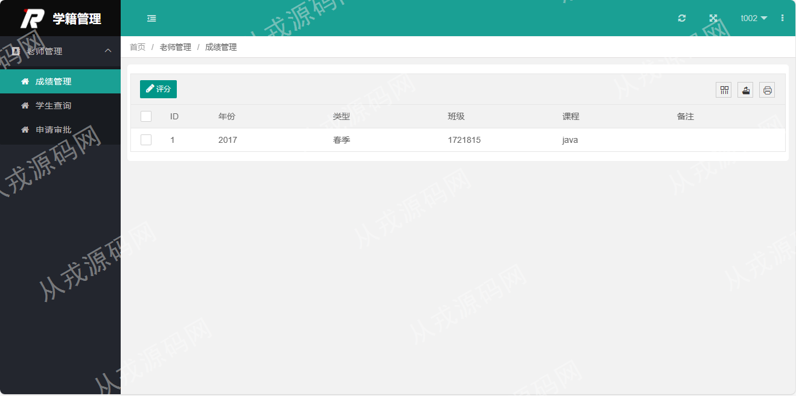

<h1 align="center">62.学生学籍管理系统</h1>

 获取sql文件 QQ: 386869957 QQ群: 377586148 

 [推荐站点: 从戎源码网](https://armycodes.com/) 

## 简介

> 本代码来源于网络,仅供学习参考使用!
>
> 提供1.远程部署/2.修改代码/3.设计文档指导/4.框架代码讲解等服务
> 
> 后端登录: http://localhost:8080/
>
> 管理员: 用户名: admin 密码: 123456
> 
> 老师: 用户名: t002  密码: 123456
> 
> 学生: 用户名: 201720181515  密码: 123456
>

## 项目介绍
基于springboot的学生学籍管理系统：前端jsp、jquery、layui，后端 maven、springmvc、spring、mybatis，集成专业管理、班级管理、课程管理、开课管理、学生管理等功能于一体的系统。

## 功能介绍

### 管理员

- 系统概览：专业、班级、课程、老师、开课、学生等数量统计，班级学生数量折线图，课程平均成绩柱状图
- 专业管理：专业信息的增删改查，专业名称和所属院系条件搜索，导出excel和csv文件，打印
- 班级管理：班级信息的增删改查，班级名称关键词搜索，导出excel和csv文件，打印，班级需要绑定专业
- 学生管理：学生信息的增删改查，姓名关键词搜索，导出文件，绑定专业和班级，设置密码用于学生登录系统
- 老师管理：老师信息的增删改查，设置密码用于老师登录系统，导出文件
- 课程管理：课程信息的增删改查，课程名称关键词搜索，导出文件
- 开课管理：开课信息的增删改查，左侧树形列表，按专业和班级进行查询开课信息
- 用户管理：用户信息的增删改查，包含密码设置用于管理员登录系统

### 老师

- 系统概览：专业、班级、课程、老师、开课、学生等数量统计，班级学生数量折线图，课程平均成绩柱状图
- 成绩管理：成绩列表查询，学生列表，给学生评分
- 学生查询：学生列表，多条件查询，导出excel和csv文件，打印

### 学生

- 选课管理：课程列表，课程选择，记录导出excel和csv文件，打印
- 成绩查询：成绩列表，导出excel和csv文件，打印，只能查询本人的成绩信息

## 环境

- <b>IntelliJ IDEA 2021.3</b>

- <b>Mysql 5.7.26</b>

- <b>JDK 1.8</b>

## 运行截图

